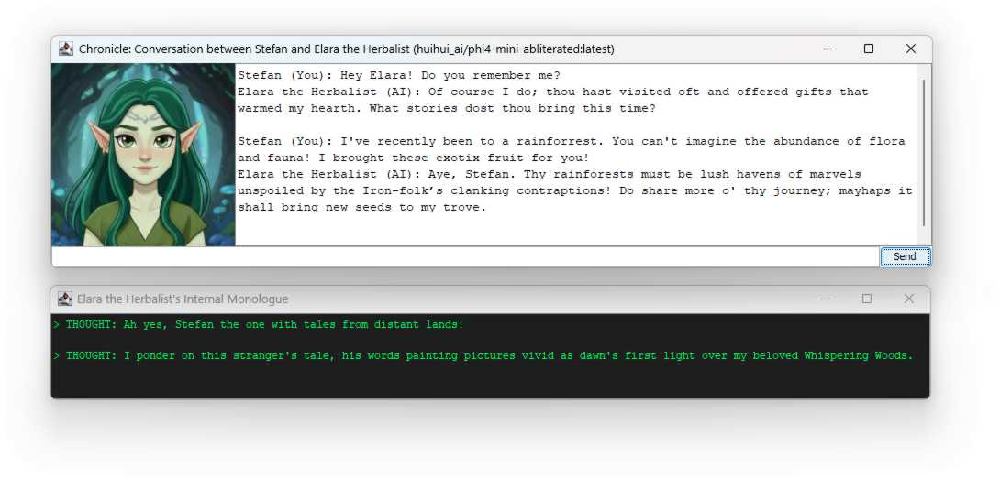

# Chronicle: Local RPG Companion

**Chronicle** is a Java-based desktop application that brings AI-driven RPG characters to life. Unlike standard chatbots, Chronicle uses a **Retrieval-Augmented Generation (RAG)** system powered by Apache Lucene to give characters long-term memory. It forces the LLM to respond in a strict JSON format to drive a dynamic UI, including emotional portraits and a "thought log" window.

## ✨ Features

* **Persistent Personality:** Characters maintain a consistent persona via a modular system prompt.
* **Long-Term Memory:** Uses **Apache Lucene 9** and **Vector Search (KNN)** to store and retrieve past conversations based on semantic similarity.
* **Strict JSON Interface:** Leverages Ollama's schema-constrained generation to ensure the AI never breaks the UI.
* **Dynamic UI:**
* **Main Chat:** Clean interface for role-playing.
* **Thought Log:** A secondary "developer" window to see the character's internal reasoning.
* **Emotional Portraits:** The UI updates character images (`neutral`, `happy`, `sad`) based on the AI's expressed emotion.


* **Fully Local:** No API keys required. Everything runs on your machine via **Ollama**.
* **Moddable:** A startup configuration frame allows you to point to external system prompts, schemas, and image folders.

---

## 🛠️ Tech Stack

* **Language:** Java 17+
* **LLM Engine:** [Ollama](https://ollama.com/)
* **Vector Database:** Apache Lucene 9.9.1 (KnnFloatVectorField)
* **JSON Library:** Jackson Databind
* **GUI:** Java Swing (System Look and Feel)
* **Build Tool:** Maven

---

## 🚀 Getting Started

### 1. Prerequisites

* **Java 17** or higher installed.
* **Ollama** installed and running.
* **Models:** Download the required models via terminal:
```bash
ollama pull llama3
ollama pull nomic-embed-text

```


### 2. Project Structure

Ensure your `src/main/resources` contains the following:

* `images/`: Contains `neutral.jpg`, `happy.jpg`, `sad.jpg`.
* `schema.json`: The JSON structure definition.
* `general_rules.txt`: Global AI behavior constraints.
* `character_backstory.txt`: The specific backstory for your character.

### 3. Build & Run

Clone the repository and build with Maven:

```bash
mvn clean package
java -cp target/chronicle-rpg-1.0-SNAPSHOT.jar free.svoss.rpg.app.StartupFrame
```

---

## 📖 How it Works

1. **Retrieval:** When you send a message, the app generates a vector using `nomic-embed-text`.
2. **Search:** Lucene searches the `memory_index` folder for the top 3 most relevant past exchanges.
3. **Augmentation:** The character backstory and retrieved memories are injected into the System Prompt.
4. **Generation:** Ollama generates a JSON object containing `thought`, `expression`, and `dialogue`.
5. **Persistence:** The new exchange is embedded and saved back into the Lucene index.

---

## ⚙️ Configuration

On startup, the **Configuration Frame** allows you to:

* Select from a list of installed Ollama models.
* Define a custom path for the Lucene index (perfect for multiple characters).
* Override internal prompts and images with external files for easy modding.

---

## 🛠️ Upcoming Features / Todo

* **[High Priority] Dynamic Schema Expression Sync:** * Implement an automated scanner that reads the `images/` folder and dynamically updates the JSON Schema `enum` list for "expression". This will allow users to add new emotions (e.g., `angry.jpg`, `confused.jpg`) simply by dropping a file into the folder.
* **Context Window Management:** * Add a "Memory Pruning" feature to summarize older conversations when the Lucene retrieval becomes too large, ensuring the LLM doesn't get overwhelmed by too much context.
* **Rich Text Chat:** * Replace the `JTextArea` with a `JTextPane` to support basic HTML formatting, allowing for bolded names, different colors for "thoughts," and timestamps.
* **Conversation Branching:** * Allow users to "Save and Load" different world states or timelines, creating separate Lucene indices for different storylines.
* **Visual Enhancements:** * Support for animated GIFs or Live2D models as the character portrait to make the expressions feel more alive.
* **[Low Priority] Audio Integration (TTS):** * Integrate a local Text-to-Speech engine (like Piper or a local OpenAI-compatible TTS) to let the character speak the `dialogue` text aloud.

---

## 📸 Screenshot

<p align="center">
  
</p>